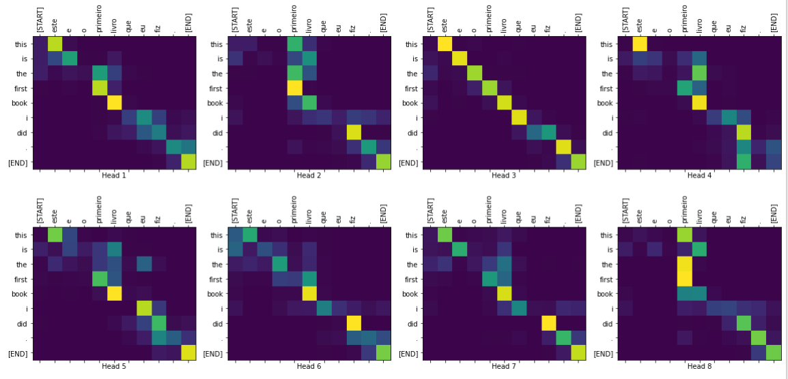
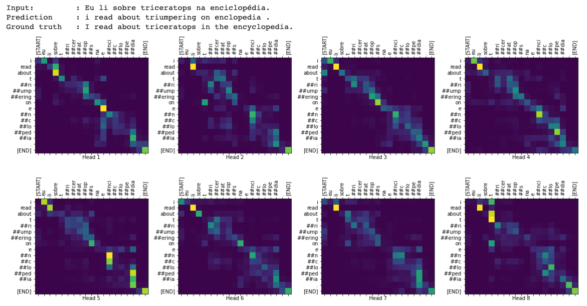

# Transformer Model for Language Understanding

[Transformer model](https://arxiv.org/abs/1706.03762) implementation from scratch and trained on [Portuguese-English translation dataset](https://github.com/neulab/word-embeddings-for-nmt) from the [TED Talks Open Translation Project](https://www.ted.com/participate/translate) to translate Portugese phrases to English phrases.

The Transformer model is implemented from scratch: Scaled Dot-Product Attention, followed by multi-head attention, afterwards building an encoder and decoder layer 
and building the overall encoder and decoder architectures. Then we build input embeddings and positional encoders and the final NN layers of the Transformer network, before combining all components to have a trainable Transformer network model.

The original text data was tokenized using a pretrained subword tokenizer that uses a BERT tokenizer optimized for the Portuguese-English translation dataset

After training for 20 epochs, the Transformer model was able to reliably translate portugese sentences to english sentences, achieving 68% test accuracy on the Portuguese-English translation test dataset. Below are a few examples of model translating along with the attention weight plots to further understand how the model performed.

Attention weight plots for a simple (known vocabulary) sentence (Portugese: "este é o primeiro livro que eu fiz.", ground truth: "this is the first book i've ever done."):

Attention weight plots for more complex (contains unknown vocabulary) sentence (Portugese: "Eu li sobre triceratops na enciclopédia.", ground truth: "I read about triceratops in the encyclopedia."):

### References
- [Attention Is All You Need](https://arxiv.org/abs/1706.03762)
- [TED Talks Open Translation Project](https://www.ted.com/participate/translate)

